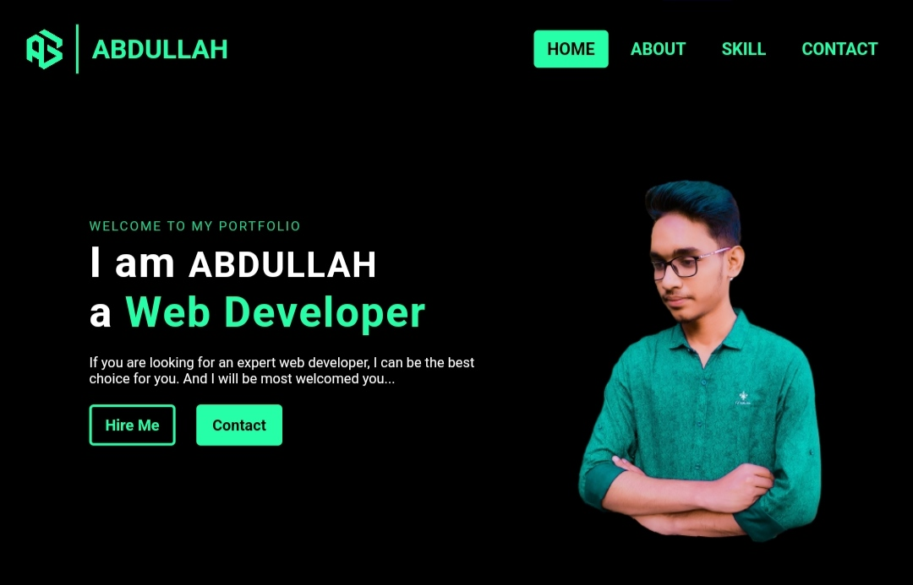

<!-- PROJECT INTRO -->

  

  <h1> Portfolio Website </h1>

  <h3> This is a portfolio website temaplate idea, not my own portfolio </h3>
  

    <a href="https://abdullahab120.github.io/Portfolio-website"> View Demo </a>
    ·
    <a href="https://github.com/AbdullahAB120/Portfolio-website/issues/new?labels=bug&template=bug-report---.md"> Report Bug </a>
    ·
    <a href="https://github.com/AbdullahAB120/Portfolio-website/issues/new?labels=enhancement&template=feature-request---.md"> Request Feature </a>
  

 
 

<!-- ABOUT THE PROJECT -->
## About The Project

This is a portfolio website template. When I have completed HTML & CSS, I made this website for practise purpose. I made this website with HTML & CSS. So It is a simple static website, also it is not responsive. But it is a creative work for me. Because this website's GUI was totally my own idea. However, you can contact with me for more information. Thank you for visiting my github repo...!

Section of this Website :
* Intro
* Personal Information
* Key Skill 
* Contact
* Copyright

 
 

<!-- BUILT WITH -->
## Built With

 
 
 
 
 
 

 
 
<!-- CONTRIBUTING -->
## Contributing

Contributions are what make the open source community such an amazing place to learn, inspire, and create. Any contributions you make are **greatly appreciated**.

If you have a suggestion that would make this better, please fork the repo and create a pull request. You can also simply open an issue with the tag "enhancement".
Don't forget to give the project a star! Thanks again!

1. Fork the Project
2. Create your Feature Branch (`git checkout -b feature/AmazingFeature`)
3. Commit your Changes (`git commit -m 'Add some AmazingFeature'`)
4. Push to the Branch (`git push origin feature/AmazingFeature`)
5. Open a Pull Request

 
 

<!-- LICENSE -->
## License

Distributed under the MIT License. See `LICENSE.txt` for more information.

 
 

<!-- CONTACT -->
## Contact 

<a href="https://www.facebook.com/AbdullahAB120"> Facebook </a>
·
<a href="https://www.instagram.com/AbdullahAB_120"> Instagram </a>
·
<a href="https://www.linkedin.com/in/AbdullahAB120"> LinkedIn </a>
·
<a href="https://www.x.com/AbdullahAB120"> Twitter </a>
·
<a href="https://www.fiver.com/AbdullahAB120"> Fiverr </a>
